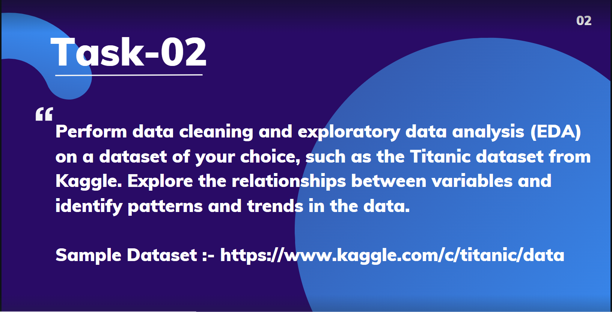

Titanic Dataset - Exploratory Data Analysis & Visualizations
============================================================

This project is part of my **Data Science Internship** at **Prodigy Infotech**. In this task, I worked on **Exploratory Data Analysis (EDA)** and **Data Visualizations** on the **Titanic dataset** to uncover patterns and insights that could be useful for modeling. The main objective was to analyze the dataset, visualize key relationships, and generate insights that would help in building predictive models.

Project Overview
----------------

In this project, the **Titanic dataset** was analyzed to understand the factors influencing survival chances. The key focus areas include:

*   **Data Cleaning**: Handling missing values and feature engineering.
*   **Exploratory Data Analysis**: Performing in-depth analysis to uncover patterns.
*   **Data Visualization**: Creating plots to visually represent relationships between different features and survival outcomes.

Technologies Used
-----------------

*   **Python**: Programming language used for data analysis and visualization.
*   **Pandas**: Library for data manipulation and analysis.
*   **Matplotlib**: Library for creating static, animated, and interactive visualizations.
*   **Seaborn**: Library for statistical data visualization based on Matplotlib.
*   **Jupyter Notebook**: Tool used for interactive development and visualization of the data.

Data Preprocessing & EDA
------------------------

Data preprocessing steps involved handling missing values, encoding categorical features, and transforming the dataset to prepare it for analysis. After preprocessing, a thorough **Exploratory Data Analysis (EDA)** was performed to analyze trends and relationships within the data.

Some common EDA techniques used included:

*   Descriptive statistics
*   Distribution plots
*   Correlation analysis
*   Handling missing values using imputation techniques

Visualizations
--------------

Several insightful visualizations were created to better understand the data. Some of the key plots include:

*   Survival rate vs. different features (e.g., Age, Sex, Pclass)
*   Correlations between numerical features
*   Histograms, box plots, and scatter plots to explore feature distributions

These visualizations helped in identifying trends and patterns that could influence survival prediction.

Key Insights
------------

Some of the key insights gained from the analysis include:

*   The survival rate was higher among females compared to males.
*   Passengers in first class had a higher survival rate compared to those in second or third class.
*   Age and family size were also strong factors influencing survival.
*   Embarked location also had some impact on survival rates.

License
-------

This project is licensed under the MIT License - see the [LICENSE](LICENSE) file for details.
